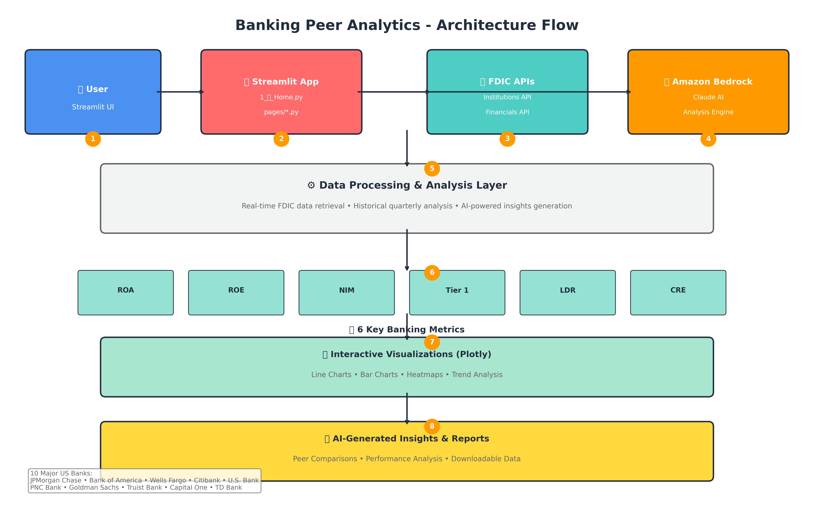

# Banking Peer Analytics POC
**Authors:** Shashi Makkapati, Senthil Kamala Rathinam, Jacob Scheatzle

## Overview of Solution
This is sample code demonstrating the use of Amazon Bedrock and Generative AI to create an intelligent banking peer analytics platform that provides real-time comparison and financial analysis using FDIC data. This example leverages live FDIC API data with 10 major US banks and 6 key banking metrics including ROA, ROE, NIM, Tier 1 Capital, LDR, and CRE Concentration.


## Goal of this POC
The goal of this repo is to provide users the ability to use Amazon Bedrock and generative AI to analyze banking performance metrics, compare peer banks, and generate intelligent insights about financial trends. The system automatically retrieves real-time data from FDIC APIs and uses Claude AI to provide comprehensive analysis and recommendations.

The architecture & flow of the POC is as follows:


When a user interacts with the POC, the flow is as follows:

1. **Bank Selection**: The user selects a base bank and peer banks for comparison through the Streamlit interface (`1_🏠_Home.py`)

2. **Metric Selection**: The user chooses from 6 key banking metrics for analysis (`pages/1_Peer_bank_analytics.py`)

3. **Data Retrieval**: The system fetches real-time data from FDIC APIs including historical quarterly data (`src/bedrock/bedrock_helper.py`)

4. **AI Analysis**: Amazon Bedrock Claude AI analyzes the banking data and generates intelligent insights (`src/bedrock/bedrock_helper.py`)

5. **Visualization**: Interactive charts display trends, comparisons, and heatmaps using Plotly (`pages/1_Peer_bank_analytics.py`)

6. **Report Generation**: The system can analyze financial reports and provide detailed insights (`pages/2_Financial_Reports_Analyzer.py`)

## Supported Banks
1. JPMorgan Chase Bank (Base Bank)
2. Bank of America
3. Wells Fargo Bank
4. Citibank
5. U.S. Bank
6. PNC Bank
7. Goldman Sachs Bank
8. Truist Bank
9. Capital One
10. TD Bank

## Banking Metrics
- **ROA** - Return on Assets: Net income as % of average assets
- **ROE** - Return on Equity: Net income as % of average equity
- **NIM** - Net Interest Margin: Interest spread as % of assets
- **Tier 1 Capital** - Core capital as % of risk-weighted assets
- **LDR** - Loan-to-Deposit Ratio: Loans as % of deposits
- **CRE Concentration** - Commercial real estate loans as % of total capital

## How to use this Repo:

### Prerequisites:
- AWS CLI installed and configured with access to Amazon Bedrock.
- Python v3.8 or greater. The POC runs on Python.
- AWS account with permissions to access Amazon Bedrock services.

### Steps

1. **Install Git (Optional step):**
```bash
# Amazon Linux / CentOS / RHEL:
sudo yum install -y git
# Ubuntu / Debian:
sudo apt-get install -y git
# Mac/Windows: Git is usually pre-installed
```

2. **Clone the repository to your local machine.**
```bash
git clone https://github.com/AWS-Samples-GenAI-FSI/peer-bank-analytics.git
```

3. **The file structure of this POC is organized as follows:**
```
requirements.txt - All dependencies needed for the application
1_🏠_Home.py - Main Streamlit application entry point
pages/1_Peer_bank_analytics.py - FDIC data analysis and visualization
pages/2_Financial_Reports_Analyzer.py - Financial report analysis
src/bedrock/bedrock_helper.py - Amazon Bedrock client wrapper
src/utils/ui_helpers.py - UI components and helpers
src/utils/bank_config.ini - Application configuration
src/utils/style.css - Custom CSS styling
src/monitoring/ - Monitoring and observability components
src/vector_store/ - Vector database components
src/graph/ - Workflow orchestration components
src/prompts/ - AI prompt templates

images/ - UI assets and architecture diagrams
scripts/ - Utility scripts for setup and maintenance
.env.example - Environment configuration template
```

4. **Open the repository in your favorite code editor. In the terminal, navigate to the POC's folder:**
```bash
cd peer-bank-analytics
```

5. **Configure the Python virtual environment, activate it:**
```bash
python -m venv .venv
source .venv/bin/activate  # On Windows: .venv\\Scripts\\activate
```

6. **Install project dependencies:**
```bash
pip install -r requirements.txt
```

7. **Configure your credentials by copying and editing the .env file:**
```bash
cp .env.example .env
```

Edit the `.env` file with your AWS credentials:
```bash
# AWS Configuration (Required)
AWS_REGION=us-east-1
AWS_ACCESS_KEY_ID=your_access_key_here
AWS_SECRET_ACCESS_KEY=your_secret_key_here

# Bedrock Configuration
BEDROCK_MODEL_ID=anthropic.claude-3-haiku-20240307-v1:0
```

8. **Start the application from your terminal:**
```bash
streamlit run 1_🏠_Home.py
```

9. **Automatic Setup:** On first run, the application will automatically:
   - Connect to FDIC APIs for real-time banking data
   - Load data for 10 major US banks with historical quarterly information
   - Initialize AI components and vector store
   - This process takes approximately 2-3 minutes

10. **Start Analyzing:** Once setup is complete, you can:
    - Compare banking metrics across peer institutions
    - Analyze quarterly trends and performance
    - Generate AI-powered insights and recommendations
    - Download analysis data for further review

## Architecture Highlights
- **Real-Time FDIC Integration**: Automatically fetches live banking data from official FDIC APIs
- **Context-Aware AI**: Claude AI provides intelligent analysis of banking performance metrics
- **Interactive Visualizations**: Plotly-powered charts with line graphs, bar charts, and heatmaps
- **Multi-Bank Comparison**: Compare up to 10 major US banks simultaneously
- **Historical Analysis**: Quarterly trend analysis from 2023-2024
- **Zero Configuration**: Just add AWS credentials and run!

## Built with:
- **Amazon Bedrock**: AI/ML models for natural language processing and analysis
- **FDIC APIs**: Official banking data from Federal Deposit Insurance Corporation
- **Streamlit**: Web interface and user experience
- **Plotly**: Interactive data visualizations
- **Python**: Core application development

## Key Features
- **Real-Time Banking Data**: Direct integration with FDIC APIs for live financial metrics
- **AI-Powered Analysis**: Claude AI provides intelligent insights and recommendations
- **Interactive Visualizations**: Dynamic charts showing trends, comparisons, and correlations
- **Multi-Bank Comparison**: Analyze up to 10 major US banks simultaneously
- **Historical Trends**: Quarterly analysis from 2023-2024
- **Performance Monitoring**: Track banking metrics over time
- **Export Capabilities**: Download analysis data for further review

## Troubleshooting

### Common Issues

**"AWS Bedrock access denied":**
- Verify your AWS credentials are configured
- Check your IAM permissions for Bedrock access
- Ensure you're in a supported AWS region

**"FDIC API connection failed":**
- Check internet connectivity
- Verify FDIC API endpoints are accessible
- Review application logs for detailed error messages

**"App won't start":**
- Ensure Python 3.8+ is installed: `python --version`
- Install requirements: `pip install -r requirements.txt`
- Try: `python -m streamlit run 1_🏠_Home.py`

**"Credentials not found":**
- Make sure you updated the .env file with your actual credentials
- Make sure .env file is in the same directory as the main application
- Verify no extra spaces in your credential values

### Getting Help
- Check AWS CloudWatch logs for Bedrock API calls
- Review Streamlit logs for application errors
- Enable debug logging: `logging.basicConfig(level=logging.DEBUG)`

## Cost Management

### AWS Costs
- **Bedrock API**: Pay-per-request pricing
- **Typical Usage**: $1-5/day for development

### Cost Optimization Tips
- Monitor Bedrock API usage
- Use caching to reduce API calls
- Configure appropriate session timeouts

## How-To Guide
For detailed usage instructions and advanced configuration, visit the application's help section within the Streamlit interface.