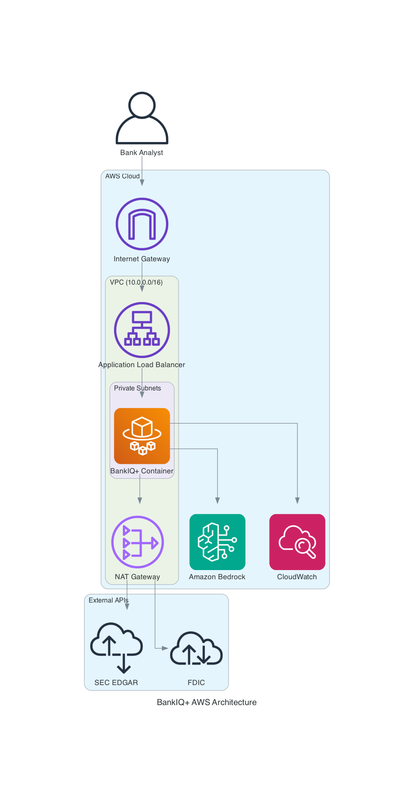
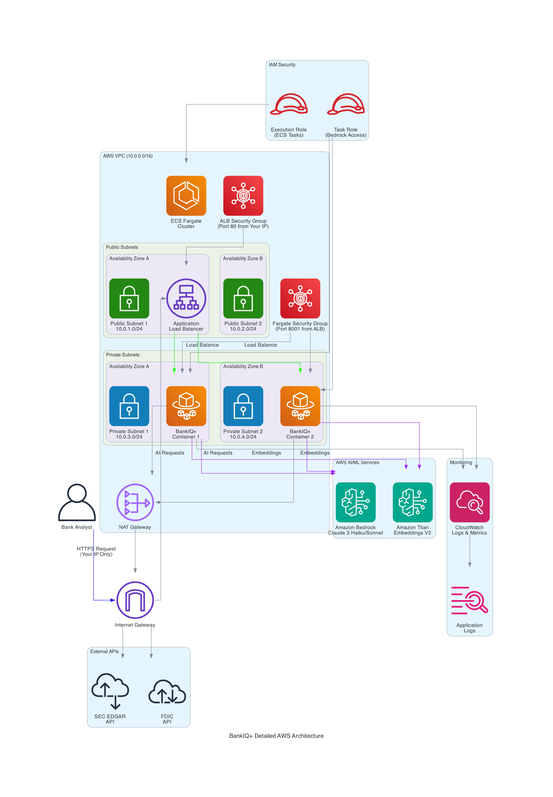

# BankIQ+ - Advanced Banking Analytics Platform
**Authors:** Shashi Makkapati, Senthil Kamala Rathinam, Jacob Scheatzle

## Background & Strategic Context

In today's competitive banking landscape, financial institutions require sophisticated peer analysis capabilities to maintain regulatory compliance, optimize performance, and make strategic decisions. Traditional banking analytics often rely on static reports and manual processes, creating delays in identifying market trends and competitive positioning. Banks need real-time access to standardized financial metrics across peer institutions to benchmark their performance against industry leaders, assess risk exposure, and demonstrate regulatory compliance to federal agencies like the FDIC and Federal Reserve.

The advent of Generative AI has revolutionized how financial institutions can process and interpret complex banking data. This Banking Peer Analytics platform represents a paradigm shift from traditional rule-based analytics to intelligent, context-aware financial analysis. By integrating Amazon Bedrock's Claude AI with real-time FDIC data and SEC EDGAR filings, the platform doesn't just present numbers—it understands relationships between metrics, identifies emerging trends, and generates human-like insights that would typically require teams of financial analysts.

The AI can instantly correlate a bank's declining Net Interest Margin with industry-wide patterns, explain the strategic implications of Tier 1 Capital changes, or predict potential regulatory concerns based on CRE concentration trends. This GenAI-powered approach transforms raw regulatory data into conversational insights, enabling bank executives to ask natural language questions like "Why is our ROA underperforming compared to similar-sized banks?" and receive comprehensive, contextual analysis that considers market conditions, regulatory environment, and peer performance.

## 🏗️ AWS Architecture



*Simple architecture overview*

### Detailed Architecture



**Key Components:**
- **VPC with Public/Private Subnets**: Multi-AZ deployment for high availability
- **Application Load Balancer**: IP-restricted access (your IP only)
- **ECS Fargate**: Serverless containers in private subnets
- **Amazon Bedrock**: Claude 3 Haiku/Sonnet for AI analysis
- **Amazon Titan**: Embeddings V2 for RAG search
- **NAT Gateway**: Secure outbound internet access
- **Security Groups**: Network-level security controls
- **IAM Roles**: Minimal permissions for Bedrock access
- **CloudWatch**: Comprehensive logging and monitoring

## 🎬 Demo


*Interactive demo showing peer bank analytics, financial report analysis, and AI-powered insights*

## ✨ Platform Features

### 📊 Peer Bank Analytics
- **Live FDIC Data**: Compare 29+ major US banks with real-time metrics
- **Custom Data Upload**: Upload quarterly/monthly CSV templates
- **AI Analysis**: AWS Bedrock Claude provides intelligent insights

### 📋 Financial Reports Analyzer
- **RAG Mode**: Fast search through pre-loaded SEC filings
- **Live EDGAR**: Real-time SEC.gov API integration
- **Local Upload**: Analyze your own 10-K/10-Q PDF files
- **AI Chat**: Interactive Q&A about financial reports

### 🔧 Analysis Modes
1. **RAG Mode**: Pre-processed SEC filings for lightning-fast analysis
2. **Live EDGAR**: Real-time SEC.gov API integration for 29+ major banks
3. **Local Upload**: Upload your own financial documents (PDF/CSV)

## 🏦 Supported Banks & Metrics

**29+ Major US Banks** including:
- JPMorgan Chase, Bank of America, Wells Fargo, Citigroup
- Goldman Sachs, Morgan Stanley, U.S. Bancorp, PNC Financial
- Capital One, Truist Financial, and 19+ more regional banks

**Key Banking Metrics:**
- **ROA** - Return on Assets: Net income as % of average assets
- **ROE** - Return on Equity: Net income as % of average equity  
- **NIM** - Net Interest Margin: Interest spread as % of assets
- **Tier 1 Capital** - Core capital as % of risk-weighted assets
- **LDR** - Loan-to-Deposit Ratio: Loans as % of deposits
- **CRE Concentration** - Commercial real estate loans as % of total capital

## 🚀 Deployment Guide

### Prerequisites

**Required:**
- AWS Account with administrative access
- AWS Bedrock access enabled (see setup below)
- Your current public IP address
- **AWS Service Limits**: Ensure you have available capacity:
  - VPCs: 5 per region (default limit)
  - Internet Gateways: 5 per region (default limit)
  - If at limits, delete unused VPCs/IGWs or request limit increases

**Enable Bedrock Access:**
1. Go to [AWS Bedrock Console](https://console.aws.amazon.com/bedrock/)
2. Navigate to **Model Access** in the left sidebar
3. Click **Request model access**
4. Enable these models:
   - **Anthropic Claude 3 Haiku**
   - **Anthropic Claude 3.5 Sonnet**
   - **Amazon Titan Embeddings V2**
5. Wait for approval (usually instant)

### Secure Deployment

**Get Your IP Address:**
```bash
curl -s https://checkip.amazonaws.com
```

**Deploy with CloudFormation:**
```bash
aws cloudformation create-stack \
  --stack-name banking-analytics \
  --template-body file://fargate-secure-template.yaml \
  --parameters ParameterKey=YourIPAddress,ParameterValue=YOUR_IP_HERE \
  --capabilities CAPABILITY_IAM
```

**Monitor Deployment:**
```bash
aws cloudformation describe-stacks \
  --stack-name banking-analytics \
  --query 'Stacks[0].StackStatus'
```

**Get Application URL:**
```bash
aws cloudformation describe-stacks \
  --stack-name banking-analytics \
  --query 'Stacks[0].Outputs[?OutputKey==`ApplicationURL`].OutputValue' \
  --output text
```

### What Gets Deployed

- **ECS Fargate Service**: Serverless container hosting
- **Application Load Balancer**: High availability and SSL termination
- **Security Groups**: IP-restricted access (your IP only)
- **IAM Roles**: Minimal permissions for Bedrock access
- **CloudWatch Logs**: Application monitoring and debugging
- **Auto Scaling**: Handles traffic spikes automatically

### Post-Deployment Verification

1. **Test Peer Analytics:**
   - Select JPMorgan Chase as base bank
   - Add 2-3 peer banks (Bank of America, Wells Fargo, etc.)
   - Choose ROE metric and run analysis
   - Verify AI analysis and chart display

2. **Test Financial Reports:**
   - Try RAG mode with a major bank
   - Upload a sample 10-K PDF file
   - Ask questions about financial performance
   - Verify AI responses with specific data

3. **Check Logs (if issues):**
   - Go to CloudWatch → Log Groups
   - Find `/ecs/bankiq-platform` log group
   - Review recent logs for errors

## 📁 Project Structure

```
current-repo/
├── frontend/                 # React application
│   ├── src/
│   │   ├── components/      # React components
│   │   └── services/        # API services
│   └── public/              # Static files & templates
├── backend/                 # Flask API server
│   ├── app.py              # Main Flask application
│   ├── rag_system.py       # FAISS vector search
│   ├── sec_edgar_live.py   # SEC API integration
│   └── bank_search.py      # Bank search functionality
└── deploy-template.yaml    # CloudFormation template
```

## 🔧 Technology Stack

- **Frontend**: React, Material-UI, Recharts
- **Backend**: Flask, Python 3.11
- **AI**: AWS Bedrock (Claude 3 Haiku/Sonnet)
- **Search**: FAISS vector database
- **APIs**: SEC EDGAR, FDIC
- **Deployment**: AWS Fargate, CloudFormation, Application Load Balancer


## 🔐 Security & Architecture Highlights

- **IP-Restricted Access**: Security Groups limit access to your IP only
- **IAM Role-Based**: Minimal required permissions for Bedrock and Fargate
- **No Hardcoded Credentials**: Environment-based configuration
- **Real-Time FDIC Integration**: Live banking data from official APIs
- **Context-Aware AI**: Claude AI provides intelligent financial analysis
- **Interactive Visualizations**: Recharts-powered dynamic charts
- **Modern UI Design**: Material-UI with professional financial theme
- **Smart Caching**: Optimized API calls and session management

## 💰 Cost Management

### AWS Costs
- **Fargate**: ~$0.05/hour when running (~$1-2/day typical usage)
- **Bedrock API calls**: Pay-per-request (~$0.01-0.10 per analysis)
- **Load Balancer**: ~$0.025/hour
- **No fixed costs**: Pay only for what you use

### Cost Optimization
- **Serverless**: Pay only when running
- Built-in caching reduces API calls
- Auto-scaling based on demand

## 📖 Usage Examples

### Peer Analytics
1. Select base bank and up to 3 peer banks
2. Choose metric (ROA, ROE, NIM, etc.)
3. Get AI-powered comparative analysis
4. Or upload your own CSV data

### Financial Reports
1. Choose analysis mode (RAG/Live/Local)
2. Select bank or upload documents
3. Ask questions via AI chat
4. Generate comprehensive reports

## 🛠️ Troubleshooting

### Common Issues

**"AWS Bedrock access denied":**
- Verify AWS credentials and IAM permissions
- Ensure Bedrock model access is enabled in AWS Console
- Check you're in a supported AWS region (us-east-1 recommended)

**"Application not loading":**
- Wait 5-10 minutes for full CloudFormation deployment
- Check Security Group allows your current IP
- Verify Fargate service is running

**"FDIC/SEC API connection failed":**
- Check internet connectivity from EC2 instance
- Review CloudWatch logs for detailed errors
- Verify API endpoints are accessible

### Getting Help

**Before Deployment:**
- Ensure you have AWS admin permissions
- Verify Bedrock model access is approved
- Confirm your IP address is correct

**During Deployment:**
- Monitor CloudFormation Events tab for progress
- Deployment typically takes 10-15 minutes
- Red events indicate issues (check IAM permissions)

**After Deployment:**
- Check AWS CloudWatch logs: `/ecs/bankiq-platform`
- Review browser console for frontend issues
- Verify Security Group allows your current IP
- Test with different browsers if needed

**Common Solutions:**
- **Bedrock Access Denied**: Enable model access in Bedrock console
- **Can't Access App**: Check your IP hasn't changed
- **Slow Performance**: Wait for container warm-up (2-3 minutes)
- **Analysis Fails**: Verify Bedrock models are enabled in your region
- **VPC/IGW Limit Exceeded**: Delete unused VPCs and Internet Gateways from EC2 console

## 🤝 Contributing

1. Fork the repository
2. Create feature branch (`git checkout -b feature/amazing-feature`)
3. Commit changes (`git commit -m 'Add amazing feature'`)
4. Push to branch (`git push origin feature/amazing-feature`)
5. Open a Pull Request

## 📄 License

This project is licensed under the MIT License - see the LICENSE file for details.

## 🆘 Support

For issues and questions:
1. Check CloudFormation stack events
2. Review application logs
3. Ensure Bedrock model access is enabled
4. Verify security group settings

---

**Built with ❤️ for the financial services community**